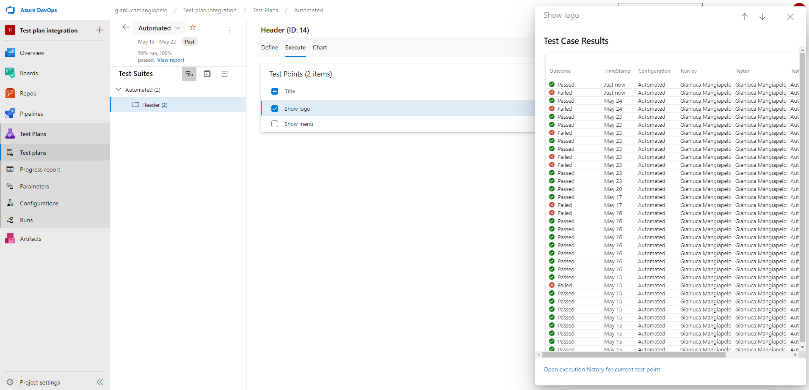

# WDIO Azure Devops Service

[](https://www.npmjs.com/package/@gmangiapelo/wdio-azure-devops-service)
[](https://www.npmjs.com/package/@gmangiapelo/wdio-azure-devops-service)

Publishes [WebdriverIO](https://webdriver.io/) results on Azure DevOps Test Plans.

Core features:

* Support for Jasmine/Jest/Mocha and Cucumber runtime frameworks
* Test results are aggregated under the same test run if you are executing more spec(test) files and they are belongs to the same suite
* Results are reported immediately after single test execution (real-time reporting)
* Test run would be closed after last spec(test) file has been finished
* Multi suite support


WorkInProgress

"reporterOptions": {
        "pat": "{Dev Ops PAT with API permissions}",
        "organization": "{Organization Name}",
        "project": "{Project Name}",
        "planId": {TestPlanId},
        "suiteId": {TestSuiteId},
        "runName": "{The Test Run name that should be assigned for Runs created by this reporter}",
        caseIdRegex?: "regExp to retrieve testId from tag or description"
      }


## Installation

Install this module locally with the following command to be used as a (dev-)dependency:

```shell
npm install --save @gmangiapelo/wdio-azure-devops-service
npm install --save-dev @gmangiapelo/wdio-azure-devops-service
```

Instructions on how to install `WebdriverIO` can be found [here.](https://webdriver.io/docs/gettingstarted)

## Usage

> _wdio-azure-devops-service_ supports **NodeJS 8 or higher**

> _wdio-azure-devops-service_ supports **commonjs** and **esm**

### Configuration

`@gmangiapelo/wdio-azure-devops-service` is a service so it can be used as a normal service. You can set it up in your `wdio.conf.js` file with the following

```js
import AzureDevopsService from "@gmangiapelo/wdio-azure-devops-service";
// wdio.conf.js
exports.config = {
    // ...
    // =====
    // Setup
    // =====
    services: [
        [
              AzureDevopsService,
              {
                  pat: 'u46xjx2ol4px36zg3z565uz52dbvshctlulkhrsecxiamn6nhtwa',
                  organizationUrl: 'https://dev.azure.com/gianlucamangiapelo',
                  projectId: '8b3c68ac-f69d-41c6-bbad-921d8bae9819',
                  planId: 263072,
                  suiteId: 263073,
                  caseIdRegex: '@?[ref](\\d+)',
                  runName: 'FE regression tests for TestPlan',
              },
          ],
    ],
    // ...
};
```

### Test case setup

Your WDIO tests should include the ID of your Azure test case. Make sure your test case IDs are distinct from your test titles:

**Mocha style:**
```Javascript
// Good:
it("C123 Can authenticate a valid user", ...

// Bad:
it("C123Can authenticate a valid user", ...
it("Can authenticate a valid user C123", ...
```

**Cucumber style:**
```Gherkin
## Good:
@C123
Scenario Can authenticate a valid user
@c123
Scenario Can authenticate a valid user,

## Bad:
@c123stringTest
Scenario Can authenticate a valid user
```

### Azure DevOps Report Example

This is an example of the results pushed on AZ Test Plans, during a test run


<br>

## Service Options

### pat

The Personal Access token generated in Azure DevOps with API permission set

Example: `"u46xjx2ol4px36zg3z565uz52dbvshctlulkhrsecxiamn6nhtwa"`

Type: `string`

Required: `true`

### organizationUrl

The base url of your Azure DevOps instance

Example: `"https://dev.azure.com/gianlucamangiapelo"`

Type: `string`

Required: `true`

### projectId

The id of the project in Azure DevOps.

To find the projectId use `GET {organizationUrl}/_apis/projects?api-version=6.0` and copy the appropriate `id`

Example: `"3cf7dbc9-cb1e-4240-93f2-9a5960ab3945"`

Type: `string`

Required: `true`

### planId

The test plainId that you can retrieve in Azure DevOps Test Plan section

Example: `124`

Type: `integer`

Required: `true`

### suiteId

The suiteId that you can retrieve in Azure DevOps Test Plan section, in case of nested suites, get the root suiteId, the service iterates over all the child suites. 

Example: `21`

Type: `integer`

Required: `true`

### runName

Decide a descriptive name for the test run.

Example: `FE regression tests run`

Type: `string`

Required: `true`

### caseIdRegex

Provide a custom regular expression to match the testCaseId from tag or title test case

Type: `string`

Default: `/@?[cC](\d+)/g`

Required: `false`

## Author
Gianluca Mangiapelo - [github](https://github.com/gianlucamangiapelo)
